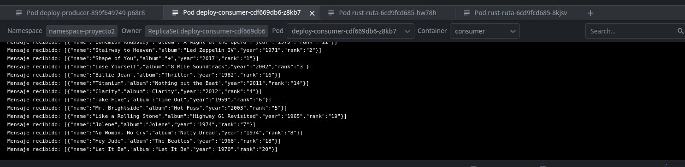

# PROYECTO 2 SO1

## Estudiante

| Nombre                     | Carnet    |
| -------------------------- | --------- |
| Angel Francisco Sique Santos | 202012039 |

## Índice

1. [Introducción](#introducción)
2. [Objetivos](#objetivos)
3. [Tecnologías utilizadas](#tecnologías-utilizadas)
4. [Conceptos clave en Kubernetes](#conceptos-clave-en-kubernetes)
5. [Funcionamiento](#funcionamiento)
6. [Conclusiones](#conclusiones)

## Introducción

El Sistema Distribuido de Votaciones es una app diseñada para gestionar un concurso de bandas de música guatemalteca. La idea es hacer que las votaciones fluyan fácilmente con archivos, utilizando una arquitectura distribuida basada en microservicios desplegados en Kubernetes.

## Objetivos

1. **Hacer un sistema distribuido con microservicios en Kubernetes:** La meta principal es armar una infraestructura que pueda crecer y estar siempre disponible, incluso cuando hay mucha gente votando al mismo tiempo.

2. **Organizar los servicios con mensajería:** Vamos a usar un sistema de mensajería para asegurarnos de que los datos de las votaciones se entreguen y procesen de manera eficiente y confiable entre todos los componentes del sistema.

3. **Poner Grafana como tablero de control:** Para mantenernos al tanto de lo que está pasando en el sistema, vamos a usar Grafana para ver en tiempo real cómo va el rendimiento y qué está haciendo la gente cuando vota.

## Tecnologías utilizadas

1. **Locust:** Locust es una herramienta de pruebas de carga escrita en Python. Se utiliza para simular la carga en una aplicación o servicio web y medir su rendimiento bajo diferentes condiciones. **Ejemplo de uso:** Imagina que tienes una aplicación de comercio electrónico y quieres saber cómo se comporta cuando miles de usuarios realizan compras simultáneamente. Puedes usar Locust para simular esas interacciones y evaluar la capacidad de tu aplicación para manejar la carga.

2. **Kubernetes:** Kubernetes es una plataforma de orquestación de contenedores que facilita la administración, escalabilidad y despliegue de aplicaciones en entornos de producción. **Ejemplo de uso:** Supongamos que tienes una aplicación compuesta por varios microservicios. Con Kubernetes, puedes definir cómo se deben desplegar, escalar y gestionar esos servicios en un clúster de servidores. Por ejemplo, puedes usar Google Kubernetes Engine (GKE) para ejecutar tus servicios en la nube de Google.

3. **Ingress en Kubernetes:** Ingress es un recurso de Kubernetes que permite exponer servicios HTTP y HTTPS fuera del clúster. **Ejemplo de uso:** Si tienes una aplicación web con varios servicios (por ejemplo, frontend, backend y base de datos), puedes usar Ingress para enrutar las solicitudes HTTP entrantes al servicio correcto en función de las rutas o dominios.

4. **gRPC:** gRPC es un sistema de comunicación de alto rendimiento desarrollado por Google. Utiliza el protocolo HTTP/2 y permite la comunicación entre servicios distribuidos. **Ejemplo de uso:** Supongamos que tienes dos microservicios que necesitan intercambiar datos. Puedes usar gRPC para definir interfaces y métodos de comunicación entre ellos, lo que facilita la integración y la transmisión eficiente de información.

5. **Rust:** Rust es un lenguaje de programación de sistemas que se centra en la seguridad, el rendimiento y la concurrencia. **Ejemplo de uso:** Si estás desarrollando un servicio crítico en términos de seguridad o rendimiento, Rust podría ser una excelente elección. Por ejemplo, podrías usarlo para implementar un componente que procesa votaciones de manera eficiente y segura.

6. **Apache Kafka:** Apache Kafka es una plataforma de streaming distribuida que permite el procesamiento de eventos en tiempo real. **Ejemplo de uso:** Si necesitas manejar grandes volúmenes de datos de votaciones en tiempo real. Puedes usar Kafka como sistema de mensajería para transmitir y almacenar esos eventos de manera confiable.

7. **Daemon en Go:** Un daemon en Go es un proceso en segundo plano que se ejecuta de manera continua y realiza tareas específicas. **Ejemplo de uso:** En tu arquitectura, podrías tener un daemon en Go que se autoescale para recopilar y almacenar los datos de Kafka en bases de datos como Redis y MongoDB.

8. **Redis:** Redis es una base de datos en memoria que se utiliza para almacenar datos clave-valor de manera rápida y eficiente. **Ejemplo de uso:** Puedes usar Redis para almacenar temporalmente los resultados de votaciones antes de que se guarden en una base de datos persistente.

9. **MongoDB:** MongoDB es una base de datos NoSQL que permite el almacenamiento flexible de datos en documentos JSON. **Ejemplo de uso:** Puedes usar MongoDB para almacenar datos de votaciones en un formato flexible y escalable.

10. **Grafana:** Grafana es una herramienta de visualización y monitoreo que permite crear paneles con gráficos y métricas. **Ejemplo de uso:** Puedes usar Grafana para crear paneles que muestren métricas en tiempo real sobre el rendimiento de tus servicios, como la cantidad de votos por minuto o la latencia de las respuestas.

11. **Cloud Run:** Cloud Run es un servicio de Google Cloud que permite ejecutar aplicaciones en contenedores de manera completamente administrada. **Ejemplo de uso:** Puedes desplegar una API y una aplicación web en Cloud Run, lo que te permite escalar y gestionar tus servicios sin tener que preocuparte por la infraestructura subyacente.

## Conceptos clave en Kubernetes

### Namespace

Los namespaces en Kubernetes son como carpetas separadas dentro de un mismo disco duro. Te ayudan a mantener tus recursos organizados y evitar que se mezclen entre sí.

### Deployment

Un deployment en Kubernetes es como tener un asistente personal que se encarga de poner en marcha, actualizar y escalar tus aplicaciones. Te libera de tener que hacer todo ese trabajo manual.

### Service

Un service en Kubernetes es como el recepcionista de un edificio de oficinas. Dirige el tráfico hacia los pods correctos y se asegura de que los usuarios lleguen a donde necesitan estar.

### Secret

Los secrets en Kubernetes son como tu caja fuerte personal. Almacenan de manera segura tus contraseñas, claves de API y otros datos sensibles, protegiéndolos de miradas indiscretas.

### Ingress

El ingress en Kubernetes es como el guardia de seguridad que controla quién puede entrar y salir del edificio. Se encarga de gestionar el tráfico entrante a tus aplicaciones desde fuera del clúster.

### KafkaTopic

Los topics de Kafka son como salas de chat separadas en una aplicación de mensajería. Te ayudan a organizar y gestionar los flujos de datos en tu clúster de Kafka, manteniendo todo bien estructurado.

## Funcionamiento

Lo primero es iniciar un tráfico desde locust

Este tráfico es recibido en un ingress que es el que envia las peticiones ya sea en este caso a la ruta `/rust/insert` o `/grpc/insert`

Este es un trafico recibido desde locust al consumer

Para llegar hasta ahí tuvo que pasar por un cliente que envía datos a un servidor y este los envia a un servidor en kafka que lo envía al consumer

Este es el cliente recibiendo la información, en este caso el cliente en grpc

Y este lo envía al servidor en grpc

Y al final es enviado por el servidor grpc a kafka

Y este lo envía al consumer

## Conclusiones

¿Cuál servicio fue más rápido?

gRPC

¿Por qué crees que fue así?

Debido a que usa HTTP2

¿Cuándo usarías gRPC y cuándo Rust?

Usaría gRPC cuando se trate de conectar un cliente con un servidor y Rust cuando se trate de crear aplicaciones que necesiten estár bien optimizadas en cuestión de el manejo de memoria
