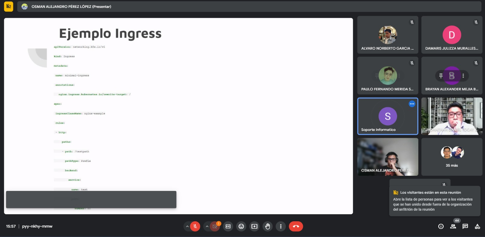
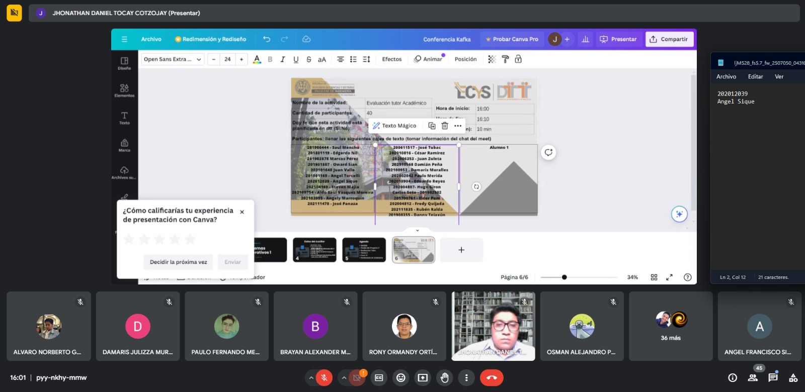

# Kubernetes, Strimzi y Kafka Connect: Herramientas para la Gestión de Aplicaciones y Datos

Kubernetes es como el jefe que organiza las aplicaciones en un edificio enorme. Cada aplicación tiene su propio espacio y necesidades, y Kubernetes se asegura de que todas estén bien cuidadas y funcionando sin problemas.

## Kubernetes: Organización Eficiente de Aplicaciones

Imagina que cada aplicación tiene una dirección en el edificio. Una dirección llamada ClusterIP permite que las aplicaciones se comuniquen entre sí dentro del edificio, mientras que otra dirección llamada NodePort las hace accesibles desde cualquier lugar, como tener una dirección en internet.

## Strimzi: Facilitando el Uso de Kafka

Ahora, Strimzi es como el asistente de Kafka, que es una herramienta útil pero complicada para mover datos rápidamente. Strimzi hace que configurar y mantener Kafka sea mucho más fácil. Automatiza todo el proceso, desde la instalación hasta el mantenimiento, para que los programadores no tengan que preocuparse tanto por los detalles técnicos y puedan concentrarse en hacer aplicaciones chéveres con datos.

## Kafka Connect: Puente entre Kafka y Otros Sistemas de Datos

Y luego está Kafka Connect, que funciona como un puente entre Kafka y otros sistemas de datos, como bases de datos y sistemas de mensajes. Básicamente, ayuda a que Kafka se comunique con otros programas para que los datos puedan fluir de un lado a otro rápidamente.

## Ejemplo de Uso Conjunto

Por ejemplo, si tienes una aplicación web en Kubernetes que necesita recopilar información de los usuarios, Kubernetes te da el lugar para ejecutar la aplicación, Strimzi facilita el uso de Kafka para recopilar datos, y Kafka Connect conecta Kafka con una base de datos donde puedes guardar toda esa información de los usuarios. Así, tu aplicación web puede acceder a esos datos fácilmente y sin problemas.

## Simplificando la Gestión de Aplicaciones y Datos

Con Kubernetes, Strimzi y Kafka Connect, los programadores tienen todas las herramientas que necesitan para hacer aplicaciones que funcionen bien con grandes cantidades de datos. Es como tener un equipo de soporte que se encarga de toda la parte técnica pesada, para que tú puedas concentrarte en hacer tu aplicación lo mejor posible.

## Imagenes

